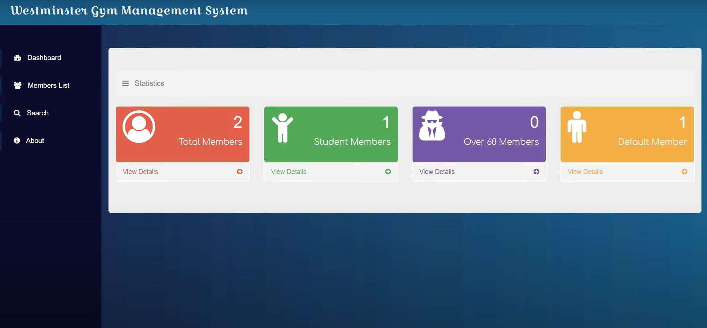

# Gym Management System - Frontend

## Overview
The project is related to a gym management system and it includes functionalities relevant to Gym management. Through the GUI, users can view all the members registered within the system and sort them according to relevant parameters. Furthermore, a search feature has been implemented so that the users can search and view all the details of any member.

### Used Technologies
* Angular
* MongoDB

## Application View

## Build

* Run `ng serve` for a dev server. Navigate to `http://localhost:4200/`. The app will automatically reload if you change any of the source files.

* Run `ng build` to build the project. The build artifacts will be stored in the `dist/` directory. Use the `--prod` flag for a production build.

This project was generated with [Angular CLI](https://github.com/angular/angular-cli) version 8.3.20.

 

## Author
Athindu Umayanga : [@Athindu](https://github.com/Athindu)

